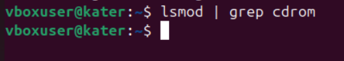

# highload_lab2_linux
## Задание 1. Kernel and Module Inspection (15 баллов)

### 1. Версия ядра
```bash
uname -r
```
Результат:  


---

### 2. Загруженные модули ядра
```bash
lsmod
```
Результат:  


---

### 3. Отключение автозагрузки модуля cdrom
```bash
echo "blacklist cdrom" | sudo tee /etc/modprobe.d/blacklist-cdrom.conf
sudo update-initramfs -u
reboot
```
Проверка:
```bash
lsmod | grep cdrom
```
Результат:  


---

### 4. Конфигурация ядра (CONFIG_XFS_FS)
```bash
grep CONFIG_XFS_FS /boot/config-$(uname -r)
```
Результат:  


---

## Задание 2. Наблюдение за VFS (20 баллов)

```bash
strace -e trace=openat,read,write,close cat /etc/os-release > /dev/null
```

Результат:  


Объяснение:
- Открывается файл /etc/os-release для чтения.
- Используются вызовы read() для чтения содержимого.
- Нет видимых write() в терминал, так как вывод был перенаправлен в /dev/null.

---

## Задание 3. LVM Management (40 баллов)

### 1. Разметка нового диска /dev/sdb
```bash
sudo fdisk /dev/sdb
```
Результат:  


---

### 2. Создание Physical Volume (PV)
```bash
sudo pvcreate /dev/sdb1
```
Результат:  


---

### 3. Создание Volume Group (VG)
```bash
sudo vgcreate vg_highload /dev/sdb1
```
Результат:  


---

### 4. Создание Logical Volume (LV)
```bash
sudo lvcreate -L 1200M -n data_lv vg_highload
sudo lvcreate -l 100%FREE -n logs_lv vg_highload
```
Результат:  


---

### 5. Форматирование и монтирование
```bash
sudo mkfs.ext4 /dev/vg_highload/data_lv
sudo mkfs.xfs  /dev/vg_highload/logs_lv

sudo mkdir -p /mnt/app_data /mnt/app_logs
sudo mount /dev/vg_highload/data_lv /mnt/app_data
sudo mount /dev/vg_highload/logs_lv /mnt/app_logs
```
Результат:  


---

## Задание 4. Использование pseudo filesystem (25 баллов)

### 1. Модель CPU и объём памяти
```bash
grep "model name" /proc/cpuinfo | head -1
grep "MemTotal" /proc/meminfo
```
Результат:  


---

### 2. PPid текущего shell
```bash
cat /proc/$$/status | grep PPid
```
Результат:  


Пояснение:  
`$$` — PID текущего shell.  
PPid — PID родительского процесса (обычно терминал или systemd).

---

### 3. I/O scheduler
```bash
cat /sys/block/sda/queue/scheduler
```
Результат:  


---

### 4. MTU интерфейса
```bash
ip link show eth0 | grep mtu
```
Результат:  


